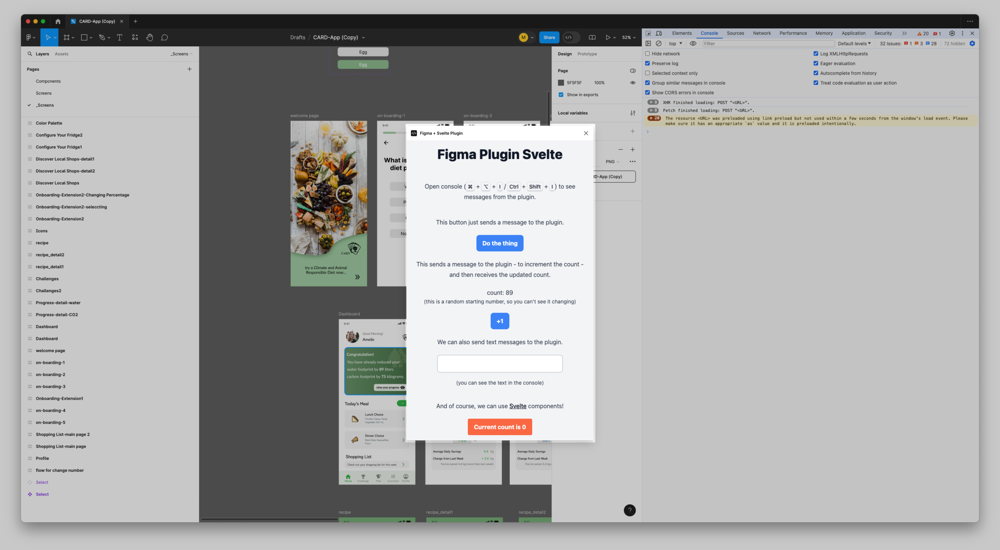

# Figma + Vite + Svelte

This project template helps you get started developing a Figma plugin using Svelte and TypeScript with Vite (and Tailwind CSS).



> [!NOTE]
> To future-proof this template I've used Svelte 5, which is perfectly usable, but not yet officially released.

### Features

- Build the UI using Svelte (_obviously_)
- Complete type safety for messages between UI and logic (see [`types.d.ts`](./src/types.d.ts))
- Use Tailwind CSS for styling
- Quick UI prototyping thanks to Vite's hot module reloading

### Recommended IDE Setup

For optimal experience make sure you have the svelte extension [Svelte](https://marketplace.visualstudio.com/items?itemName=svelte.svelte-vscode).

## Project Structure

- **public/manifest.json**: That's the [plugin manifest](https://www.figma.com/plugin-docs/manifest/) file. You should change the `name` there, rest can be left as is.

- **src/**: Contains the source code for the project.

  - **lib/**: Contains the files you might want to reuse across the plugin ui and logic.

    - `index.ts`: Contains an example of a function that can be used in both the UI and logic.

  - **plugin_logic/**: Contains the logic for the Figma plugin.
    Thats where you can interact with the [`figma`](https://www.figma.com/plugin-docs/api/figma/) API.

  - **plugin_ui/**: Contains the UI components for the Figma plugin.

    - `Plugin.svelte`: UI entrypoint component for the Figma plugin.
    - You can create more components here.

  - `app.css` Global CSS for the application.

  - **types.d.ts**: TypeScript declaration file.
    - It contains definitions for the messages you can send between the plugin UI and logic.

Other files are for configuration - you shouldn't need to touch them.

## Build and Development Commands

> I personally recommend using [Bun](https://bun.sh/), bun you can also just use `(p)npm`. [^1]

[^1]: If you use raw `npm`, use `npm run <script>` instead of `bun <script>`.

### Install dependencies

```sh
bun install
```

### Initial setup

According to the [docs](https://www.figma.com/plugin-docs/) each plugin needs to have a unique `id` in the [`manifest.json`](./public/manifest.json).

You can add one by running:

```sh
bun run gen:uuid
```

This will generate a random UUID and add it to the `manifest.json`.

### Develop just UI

If you want to first prototype **only** the UI, you can run the following command:

```sh
bun dev
```

Now you can open the browser at `http://localhost:5173` to see the UI.
I recommend using [responsive mode](https://developer.chrome.com/docs/devtools/device-mode/#responsive) to simulate the plugins window size.

### Use with Figma Desktop

After you run

```sh
bun run build
```

you'll get a `dist/` folder, that contains the compiled plugin code.

Now in Figma desktop, you can add your plugin by going to `Plugins` -> `Development` -> `Import plugin from manifest...` and selecting the `dist/manifest.json` file.

Of course, it would be nice if the plugin could reload automatically when you save changes.
You can achieve that by opening two terminals and running:

```sh
bun dev:ui
```

This watches for changes in the UI code and rebuilds it.

```sh
bun dev:plugin
```

This watches for changes in the plugin logic code and rebuilds it.

<details>
<summary>Why do we need two terminals?</summary>

The plugin logic and UI are two different independent parts.
We put them in one project for ease of development and code sharing,
but ultimately they need to be compiled separately.

</details>
